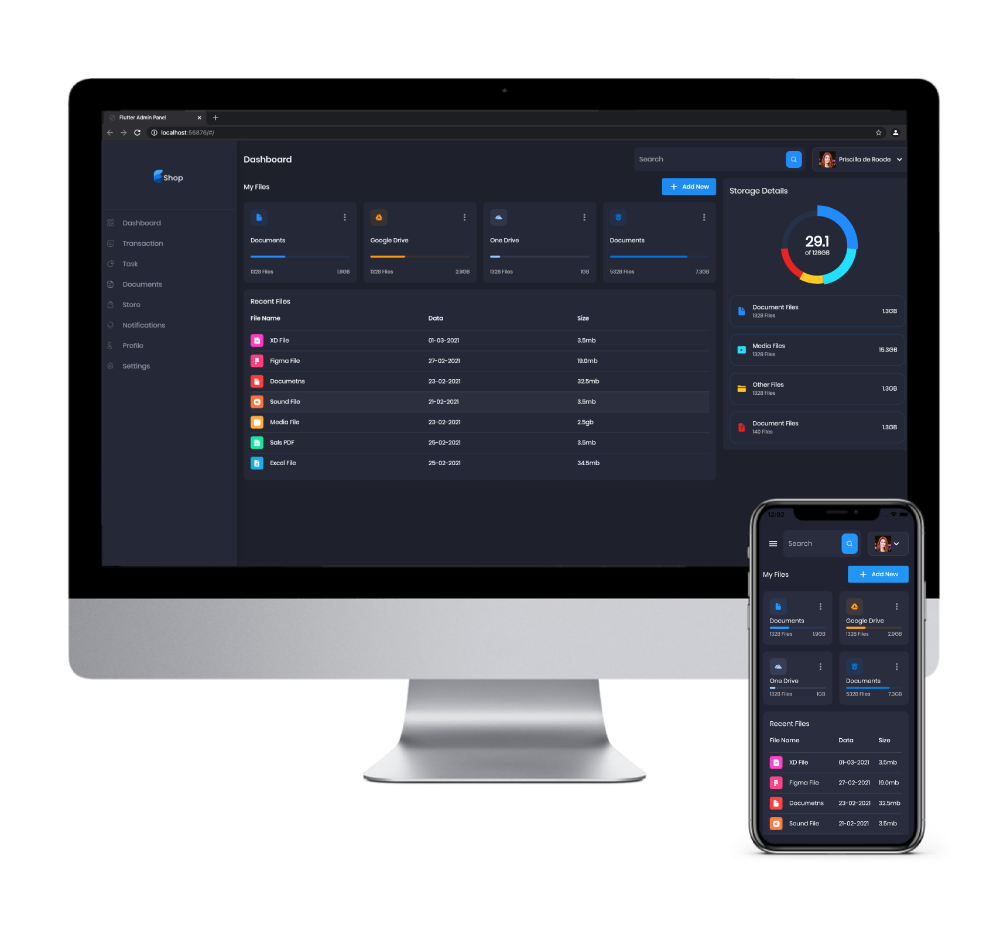

<h1 align="center">
  
</h1>

  <a href="#-tecnologia">Tecnologia</a>&nbsp;&nbsp;&nbsp;|&nbsp;&nbsp;&nbsp;
  <a href="#books-bibliotecas">Bibliotecas</a>&nbsp;&nbsp;&nbsp;|&nbsp;&nbsp;&nbsp;
  <a href="#-projeto">Projeto</a>&nbsp;&nbsp;&nbsp;|&nbsp;&nbsp;&nbsp;
  <a href="#dart-objetivo">Objetivo</a>&nbsp;&nbsp;&nbsp;|&nbsp;&nbsp;&nbsp;
  <a href="#-como-executar">Como executar</a>&nbsp;&nbsp;&nbsp;|&nbsp;&nbsp;&nbsp;

  

 

  

## ✨ Tecnologia

Esse projeto foi desenvolvido com a seguinte tecnologia:

- [Flutter v.2.2.1](https://flutter.dev/)

## :books: Bibliotecas

- [flutter_svg](https://pub.dev/packages/flutter_svg)
- [google_fonts](https://pub.dev/packages/google_fonts)
- [provider](https://pub.dev/packages/provider)
- [fl_chart](https://pub.dev/packages/fl_chart)

## 💻 Projeto

O Shop é um dashboard contendo tabelas, gráficos, cards para apresentar informações.

## :dart: Objetivo

Aplicar o conceito de responsividade utilizando um único código para que a aplicação seja utilizada no IOS, Android e Web.

## 🚀 Como executar

- Clone o repositório
- Instale as dependências com `flutter pub get`
- Inicie o aplicativo com `flutter run dev`
